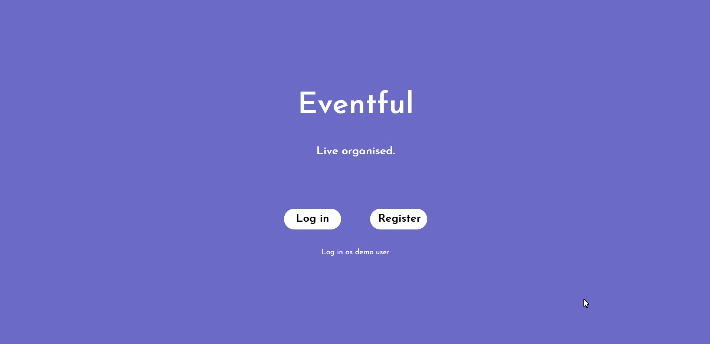
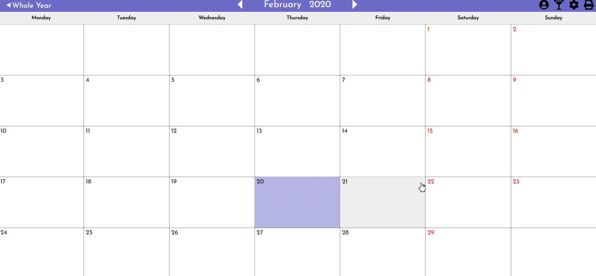
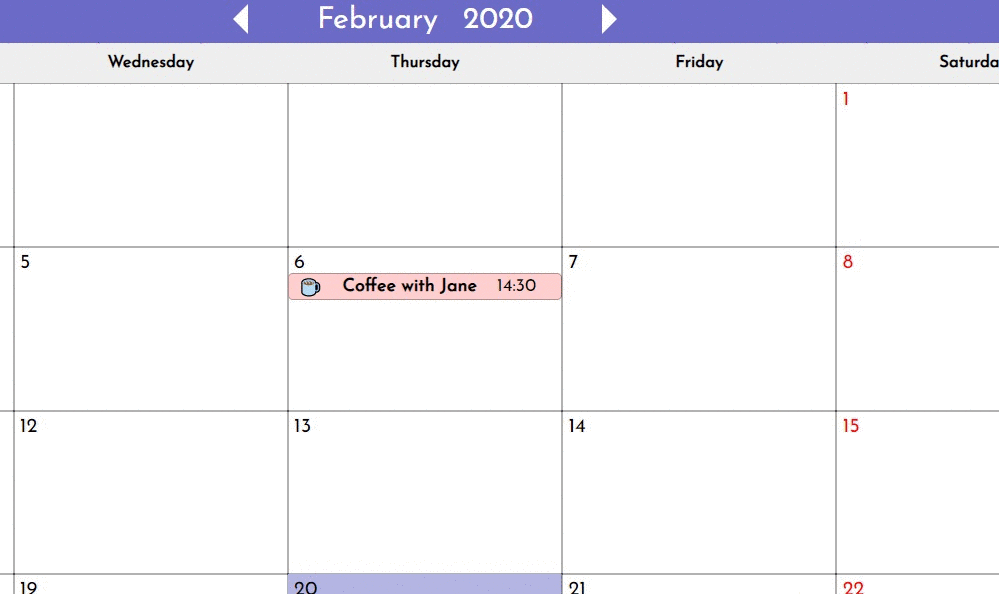
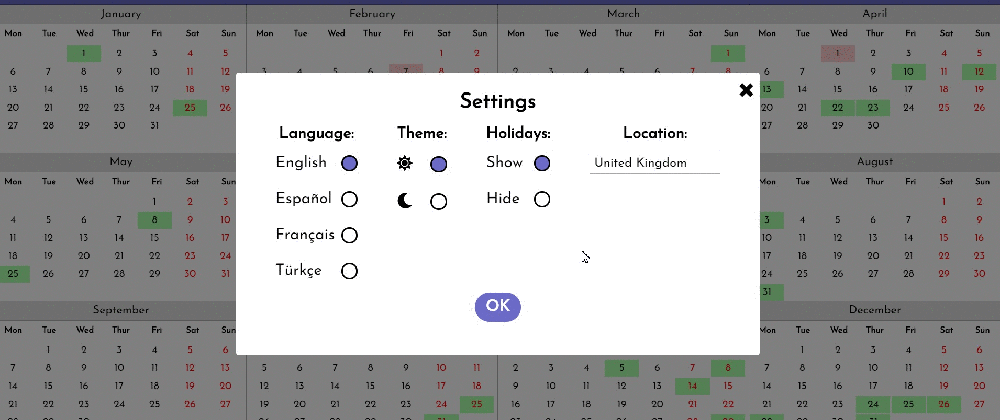
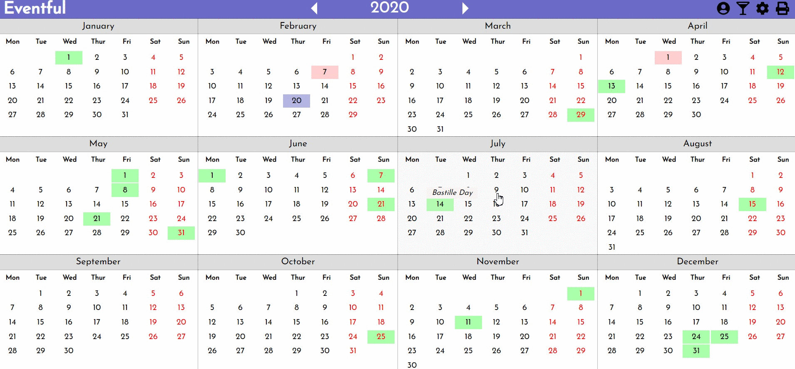
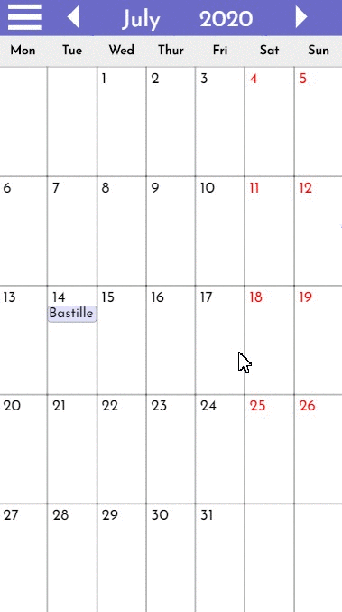

[

](http://eventful-calendar.co.uk/)

<h1 style="text-align: center">Eventful</h1>

<h2 style="text-align: center">A calendar app built with React, Node.js, Express and MongoDB.</h2>

---

### FEATURES OVERVIEW

- Authentication system with password encryption and JSON web tokens
- Add, Edit, Delete events
- Drag and drop events
- Add time and/or emoji to events &#128054;
- Toast alerts when event saved/deleted
- Automatic chronological ordering of events
- Automatic fetching of national holidays and festival based on user’s location
- Light and dark mode &#127774; &#127768;
- Choice of four languages - English, Spanish, French and Turkish
- Choice of over 200 countries for national holidays &#127757;
- Settings preferences saved in local storage
- Responsive design
- Printable

### CONTENTS

- [Installation](#installation)
- [Technologies](#technologies)
- [APIs](#apis)
- [How it works](#howitworks)
  - [Authentication/Authorization](#authentication)
  - [Adding, deleting and editing events](#adding-events)
  - [Calendar structure](#calendar-structure)
  - [Changing the date](#changing-date)
  - [Composition of calendar days](#days)
  - [Database](#database)
  - [Drag and drop](#drag-and-drop)
  - [Holidays](#holidays)
  - [Languages](#languages)
  - [Light and dark mode](#light-and-dark)
  - [Modals](#modals)
  - [My Events](#my-events)
  - [Printing](#printing)
  - [Responsive design](#responsive)

### INSTALLATION

To run this project on your own computer:

1. Clone/download the repo
2. Run npm install in both the root directory and the client directory
3. In the following files in client/src/2-context, delete "/api" from the beginning of the urls passed into the axios calls and replace it with “http://localhost:5000”:

- AuthContext.js
- HolidaysContext.js
- EventsContext.js

4. Sign up to [OpenCageData](https://opencagedata.com/api) and [Calendarific](https://calendarific.com) (for free) to get your own API keys and include them in server.js or put them in a .env file.
5. In the parent directory, run npm run dev (this starts the server with Nodemon and starts the React project simultaneously)

### TECHNOLOGIES/LIBRARIES

- [React](https://github.com/facebook/react) - frontend framework
- [Node.js](https://github.com/nodejs/node) - JavaScript runtime environment for the backend REST API
- [Express](https://github.com/expressjs/express) - framework for Node.js
- [MongoDB](https://www.mongodb.com/) - database
- [Mongoose](https://github.com/Automattic/mongoose) - framework for interacting with MongoDB
- [bcrypt](https://github.com/kelektiv/node.bcrypt.js#readme) - for encryption of user passwords
- [Axios](https://github.com/axios/axios) - for calls to backend and APIs
- [jsonwebtoken](https://github.com/auth0/node-jsonwebtoken#readme) - tokens for authentication
- [UUID](https://github.com/uuidjs/uuid) - for random ids (used for events)
- [React Router](https://github.com/ReactTraining/react-router) - for routing
- [Font Awesome](https://github.com/FortAwesome/Font-Awesome) - for icons
- [react-beautiful-dnd](https://github.com/atlassian/react-beautiful-dnd) - for drag and drop functionality

### APIs

- [Calendarific](https://calendarific.com) - for data on holidays/festivals
- [OpenCage Geocoder](https://opencagedata.com/) - to identify country based on coordinates

### HOW IT WORKS

#### AUTHENTICATION & AUTHORIZATION

The main calendar component is found at the _*/calendar*_ path which is a protected route. This is implemented with a [ProtectedRoute component](./client/src/0-components/ProtectedRoute.js) which takes the path and component as props. When a user attempts to access this path, it checks whether _*authenticated*_ is set to true (accessed via context) and, if so, returns the requested component, otherwise it redirects the user to the home screen where they can log in or register.

The app uses the built-in HTML5 form validation during registration but also custom validation to ensure, additionally, that the email address ends with a TLD and that the passwords match. Custom styling is also used to indicate whether a form input has been filled with valid data (green background if valid, red if not). If the user attempts to register with invalid data, or if the email address is already registered, the validation system on the backend will return a custom error message which is displayed in red text below the form.

If all data is valid, the password will be hashed with bcrypt and the new user will be saved to the database. After registering (or logging in) successfully, a JSON web token will be signed (using the jsonwebtoken package) and returned to the frontend where it will be saved in local storage. Also, _*authenticated*_ will be set to true and the user will be redirected to the main calendar page.

When the user attempts to perform any CRUD operation, a middleware function called [verifyToken](https://github.com/tommcandrew/eventful-calendar/blob/04fbde7f288f9b78c8406865443c042e6d5f4c7b/server.js#L23-L37) runs on each request which extracts the token from the request headers and verifies it (using the same jsonwebtoken package).

The user can log out of the app by clicking on the My Account icon in the top right of the screen and clicking the log out button. When they do this, _*authenticated*_ will be set to false, the token in local storage will be deleted and they will be redirected to the home screen.

#### ADDING, DELETING AND EDITING EVENTS

When a day in the calendar is clicked, the [DayEvents](./client/src/0-components/DayEvents.js) modal opens showing a list of events on that day, if there are any. The Add Event button opens the [EventForm](./client/src/0-components/EventForm.js) modal which has a text input for the event title (required) as well as buttons that open menus to add a time and emoji (optional). All CRUD operations are managed in [EventsContext](./client/src/2-context/EventsContext.js). To ensure smooth performance, updates are made optimistically, so the app state is updated first and the database is updated after this. Once the database has been updated, events are fetched again and an object with text is passed into an _*alertInfo*_ variable in state (e.g. Saved, Deleted, Not saved) which causes the [Alert](./client/src/0-components/Alert.js) component to render and pop down from the top of the screen. An [effect hook](https://github.com/tommcandrew/eventful-calendar/blob/04fbde7f288f9b78c8406865443c042e6d5f4c7b/client/src/2-context/EventsContext.js#L24-L31) in EventsContext sets the value of _*alertInfo*_ to null after 5 seconds so that the alert disappears. The alert will be green in the case of success and red if the update failed.

To edit an event's info, the user just clicks on the event and then clicks the Edit button. This opens the same form used when first adding the event but each input will be populated with the event's info, including the time and emoji inputs. This is achieved with a _*selectedEvent*_ variable in the EventForm component's state which is set when the user clicks on any event. The default values for the [input variables](https://github.com/tommcandrew/eventful-calendar/blob/04fbde7f288f9b78c8406865443c042e6d5f4c7b/client/src/0-components/EventForm.js#L24-L32) in state are set to _*selectedEvent*_'s values, if not null, otherwise they will be set to empty strings. The user can edit the event's info (or remove it in the case of time and emoji) before re-saving the event. If the user wants to move the event to a different date, they can do this by dragging and dropping (see [below](#drag-and-drop)).

#### CALENDAR STRUCTURE

The calendar itself is composed using two functions - [createYearArray()](./client/src/1-utils/createYearArray) and [createMonthArray()](./client/src/1-utils/createMonthArray). The first is triggered with an [effect hook](https://github.com/tommcandrew/eventful-calendar/blob/04fbde7f288f9b78c8406865443c042e6d5f4c7b/client/src/0-components/Calendar.js#L23-L30) in the Calendar component which runs when the _*dateObj*_ in context is set. This createYearArray simply calls the createMonthArray twelve times, passing in the year of the _*dateObj*_ and the value of _*i*_ from the for loop to represent the month, and pushes the returned arrays into a single year array. The createMonthArray function uses these arguments to get the date of the first day of the month, get the day index (e.g. 3 for Wednesday) and then count the number of days from the previous Sunday - these will be blank cells in the calendar. The JavaScript date object counts Sunday as the start of the week with an index of 0 so the function gives Sundays an index of 7 instead, so that there are 6 blanks before it if the month starts on a Sunday.

Similarly, the function finds the date of the last day of the month and creates blanks for the end of the month by subtracting the number of preceding days and blanks already pushed onto the month array from 42 (the total number of cells).

For each cell in the calendar (both days and blanks), an object is pushed onto a month array. In the case of a blank, the date is set to -1. The reason blanks are given a date value at all is so the contents of each cell take up equal space and CSS issues are avoided. This -1 is not visible in the calendar.

#### CHANGING THE DATE

There are three ways to change date in the calendar. In month-view, the user can click the arrows in the header to go forward or back one month. Before changing the month, the [setMonth](https://github.com/tommcandrew/eventful-calendar/blob/04fbde7f288f9b78c8406865443c042e6d5f4c7b/client/src/0-components/Calendar.js#L49-L60) function which is triggered checks to see whether the new month index is -1 or 12, meaning that the user has moved into the previous or following year respectively, and updates the year and month accordingly.

In year-view, there are also arrows in the header which move the year either forward or back. A faster alternative to the arrows (if changing more than just a few years) is to click on the date between the arrows in the header in month-view. A drop down menu will appear with two scrollable lists - one for months and the other for years. The user can quickly jump to any month/year in the last century.

#### COMPOSITION OF CALENDAR DAYS

Months are composed by [mapping](https://github.com/tommcandrew/eventful-calendar/blob/04fbde7f288f9b78c8406865443c042e6d5f4c7b/client/src/0-components/Month.js#L61-L72) over the month arrays produced by the [createMonthArray()](./client/src/1-utils/createMonthArray) function and returning a [Day](./client/src/0-components/Day.js) component.

A number of functions run inside this component before any JSX is rendered. First, it gets an array of any events which are on this day using the [getDayEvents()](./client/src/1-utils/getDayEvents.js) function which receives the events array from context as an argument along with the day object. This function loops over all the events and returns an array of events with a matching date.

Next in the Day component, the events returned from getDayEvents() are sorted chronologically with the [sortEvents()](./client/src/1-utils/sortEvents.js) function. It works by first comparing the years of events, then months, then days and so on, until the order can be determined. Events are left in the same order as in the database if there is no difference in time.

After this, the component gets an array of holidays on the day with the [getHolidayNames()](./client/src/1-utils/getHolidayNames.js) function.

Events (and holidays) are represented in the calendar as 'bars' with the title as well as any emoji or time that user has also added. These bars stack on top of each other in the calendar's day cells. Obviously, space is limited, so if a single day has more than 4 events (or the combination of events and holidays is more than four), just a single bar is displayed which says the number of events there are. This is done with a simple [if/else statement](https://github.com/tommcandrew/eventful-calendar/blob/04fbde7f288f9b78c8406865443c042e6d5f4c7b/client/src/0-components/Day.js#L39-L45) in the Day component which sets the _*eventsToDisplay*_ array to a single object with text which tells the user the number of events there are on that day.

Next, an array of classNames for the Day element is composed by calling the [getCellClassNames()](./client/src/1-utils/getCellClassNames.js) function. This function adds a className based on whether the cell is blank or not, whether the date is today's date and whether it's a weekend or if if there is a holiday or event on that day.

In year-view, each month has 6 rows (42 cells). This is so that the size of each month on the screen is uniform. This is despite the fact that some months only take up 5 rows. In month-view, if the last row of a month does not have any days, it is hidden to provide more space on the screen. This is achieved by [applying a className](https://github.com/tommcandrew/eventful-calendar/blob/04fbde7f288f9b78c8406865443c042e6d5f4c7b/client/src/1-utils/getCellClassNames.js#L22-L25) of "hideRow" to the first cell in the 6th row if it has a date of -1 (i.e. if it's blank). The row is then hidden with a [CSS rule](https://github.com/tommcandrew/eventful-calendar/blob/04fbde7f288f9b78c8406865443c042e6d5f4c7b/client/src/4-styles/component-styles/_Day.scss#L124-L131).

In year-view, as the cells are so small, event bars and holiday bars cannot be displayed. Instead, these cells are highlighted a different color. When hovered, a tooltip-style message appears telling the user the name of any holiday on that day and whether that day is today and telling them the number of events they have on that day. For each day an array of these messages is created with the [getDayHoverMessages()](./client/src/1-utils/getDayHoverMessages.js) based on the holidayNames, eventsOnThisDay and classNames arrays created earlier.

#### DATABASE

MongoDB is used to store data and Mongoose is used as a framework for interacting with the database. The app [connects](https://github.com/tommcandrew/eventful-calendar/blob/04fbde7f288f9b78c8406865443c042e6d5f4c7b/server.js#L15-L19) to the database in [server.js](./server.js). Only one Mongoose schema is used - [User](./mocels/User.model.js). This schema has 4 keys - name, email, password and events. The events key is set to an array which contains objects for each event.

#### DRAG AND DROP

Thanks to the react-beautiful-dnd library, events can be easily dragged and dropped in a different day. A function called [onDragEnd()](https://github.com/tommcandrew/eventful-calendar/blob/04fbde7f288f9b78c8406865443c042e6d5f4c7b/client/src/0-components/Month.js#L26-L32) is called in the Month component when the user drops the event. This function calls the [moveEvent](https://github.com/tommcandrew/eventful-calendar/blob/04fbde7f288f9b78c8406865443c042e6d5f4c7b/client/src/2-context/EventsContext.js#L67-L94) function in EventsContext.

The react-beautiful-dnd library provides a Draggable component (for events) and a Droppable component (for days). Droppables require a unique id. A [date string](https://github.com/tommcandrew/eventful-calendar/blob/04fbde7f288f9b78c8406865443c042e6d5f4c7b/client/src/0-components/Day.js#L90) has been used for these ids. The moveEvent function extracts the date of the destination day from this id, then maps over all the events (from context) and replaces the data of the matching event when it finds it. It then updates the local version of events before calling the moveEvent function on the backend which updates the database. Updates are performed in this order (local first, then database) because, otherwise, there would be a visible lag when the user drops the event.

#### HOLIDAYS

On authentication, an [effect hook](https://github.com/tommcandrew/eventful-calendar/blob/04fbde7f288f9b78c8406865443c042e6d5f4c7b/client/src/0-components/Day.js#L90) in HolidaysContext makes a call to the backend which in turn makes [a call](https://github.com/tommcandrew/eventful-calendar/blob/04fbde7f288f9b78c8406865443c042e6d5f4c7b/server.js#L205-L218) to the Calenderific API to get a list of supported countries (if not already saved in local storage). These are then used to populate the location menu in settings. The same hook also calls [a function](https://github.com/tommcandrew/eventful-calendar/blob/04fbde7f288f9b78c8406865443c042e6d5f4c7b/client/src/2-context/HolidaysContext.js#L61-L69) that checks local storage for a saved preference for holidays - whether they should be displayed in the calendar or not. If nothing is found, it's set to the default - 'Show'.

Whenever the holidays preference changes, the new preference is [saved](https://github.com/tommcandrew/eventful-calendar/blob/04fbde7f288f9b78c8406865443c042e6d5f4c7b/client/src/2-context/HolidaysContext.js#L71-L88) in local storage. If it's being changed from 'Hide' to 'Show', the app checks local storage for a saved location object. If found, it sets state with it, if not found, it [attempts](https://github.com/tommcandrew/eventful-calendar/blob/04fbde7f288f9b78c8406865443c042e6d5f4c7b/client/src/2-context/HolidaysContext.js#L90-L114) to get the user's location. This is done with the Geolocation API and specifically the getCurrentPosition() method. If permission is given, the coordinates obtained are then used in a call to the backend which makes [a call](https://github.com/tommcandrew/eventful-calendar/blob/04fbde7f288f9b78c8406865443c042e6d5f4c7b/server.js#L220-L235) to the OpenCage API which sends back the name of the country the user is located in as well as the country code. These are then saved in state in the HolidaysContext file. If permission is not given to access the user's location, United Kingdom is set as the default.

Whenever the location object in HolidaysContext state changes, the country object is saved to local storage. Before making an API call to get holidays for that country, the app checks the storedHolidays array to see if they've already been saved there and, if not, it checks local storage. If the correct holidays are not found in either, it makes the API call.

[fetchHolidays()](https://github.com/tommcandrew/eventful-calendar/blob/04fbde7f288f9b78c8406865443c042e6d5f4c7b/client/src/2-context/HolidaysContext.js#L144-L176) makes a call to the backend which in turn makes [a call](https://github.com/tommcandrew/eventful-calendar/blob/04fbde7f288f9b78c8406865443c042e6d5f4c7b/server.js#L181-L203) to the Calendarific API. The holidays in the response are filtered for national holidays, common local holidays and observances. This array of holidays is saved twice to state - to _*holidays*_ and _*storedHolidays*_. The first array is what's passed down to other components in the calendar and causes holidays to be displayed. If the user turns off holidays in settings, this array is [cleared](https://github.com/tommcandrew/eventful-calendar/blob/04fbde7f288f9b78c8406865443c042e6d5f4c7b/client/src/2-context/HolidaysContext.js#L77). The second array is kept as a backup so that, if the user turns holidays on again, another call to the API will not be required.

Although the app's location will be set to the user's location if they grant access, they can easily change it if they would like to see holidays from a different country. In the [settings component](./client/src/0-components/Settings), under Language, there is a text input, the value of which will be whatever the current location is set to. To change it, the user can simply delete the value in the input field and type the name of a different country. This input field is its own [component](./client/src/0-components/AutoComplete.js) with auto-complete functionality. The component receives an array of options and populates a list with them. The list is invisible until the user starts typing in the input. The [onChange handler](https://github.com/tommcandrew/eventful-calendar/blob/04fbde7f288f9b78c8406865443c042e6d5f4c7b/client/src/0-components/AutoComplete.js#L7-L17) then filters through all of the options and only displays in the list options which contain matching text.

The list can also be navigated using the arrow keys. This is done by help of the [activeOption](https://github.com/tommcandrew/eventful-calendar/blob/04fbde7f288f9b78c8406865443c042e6d5f4c7b/client/src/0-components/AutoComplete.js#L4) index in state which is incremented or decremented when the user clicks one of the arrows. When the list items mapped and rendered, an [if/else statement](https://github.com/tommcandrew/eventful-calendar/blob/04fbde7f288f9b78c8406865443c042e6d5f4c7b/client/src/0-components/AutoComplete.js#L74-L78) checks whether the item's index is the same as activeOption and, if so, applies a className indicating this. This className is used to highlight the item with [a CSS rule](https://github.com/tommcandrew/eventful-calendar/blob/04fbde7f288f9b78c8406865443c042e6d5f4c7b/client/src/4-styles/component-styles/_AutoComplete.scss#L19-L24).

#### LANGUAGES

Users can choose between four languages - English (default), French, Spanish and Turkish. The file siteText.js contains translations of each piece of text used in the app in the four languages. The correct option is retrived using bracket notation with the language value passed down from LanguageContext. There are separate files for the months and weekdays, also in the the four languages.

#### LIGHT AND DARK MODE

One of the options in settings is to choose between a light mode and dark mode. Light mode is the default and, with this set, days and modals will have a white background. In dark mode, the background color of days and modals is dark blue/purple. The styling is controlled using the Context API which tells each component which mode is currently set. This is then used to conditionally add classNames, e.g. month--dark. When the user changes this setting, the new preference is saved in local storage so it will be the same the next time they log in.

#### MODALS

#### MY EVENTS

#### PRINTING

A printer icon is in the top right of the screen. When clicked, it will open the print window on the user's computer ready to print whatever screen they were looking at (either whole year-view or single month-view). The orientation of the page will be set to landscape automatically. This is achieved with a media query.

#### RESPONSIVE DESIGN

On mobile screens, only month-view is available. Also, the row of icons for My Account, My Events, Settings and Print does not appear in the header. Instead, there is a hamburger menu icon which opens an expanding menu with links to these components.

## License

- **[MIT license](http://opensource.org/licenses/mit-license.php)**
